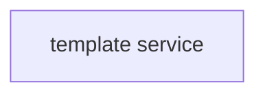

# Golang Template service

Outline of module's purpose, more details in Confluence.
> Confluence:
> GitHub, code:
> GitHub, deployment:
> GitHub, specifications:

## Overview

### Packages

| Package                  | Description                                                                    |
|--------------------------|--------------------------------------------------------------------------------|
| `/.gitlab-ci.yml`        | CI/CD build config and overridden properties in `app-config.yml`               |
| `/.docker-compose.yml`   | for local dev's tests only. Zookeper & UI + initial provisioning.              |
| `/cmd`                   | `main.go` - the entrypoint for the application                                 |
| `/cmd/features`          | acceptance tests implemented with the gherking syntax - bdd tests              |
| `/cmd/schema`            | dynamo db table and indexes schema used in the service                         |
| `/cmd/startup`           | structured code to initialize all components to start the service              |
|                          | common test utilities & per-feature implementations                            |
| `/config`                | `app-config.yml` - default overridable config for application                  |
|                          | Config resource structs populated from `app-config.yml`                        |
| `/internal/controller`   | HTTP probes, top-level request/response logic                                  |
| `/internal/dynamics`     | Dynamics is a dynamic values generator at the UUID and Time Level              |
| `/internal/model`        | business model                                                                 |
| `/internal/route`        | paths of HTTP endpoints                                                        |
| `/internal/service/core` | Echo HTTP service                                                              |
| `/pkg/client`            | business logic for invoke the main service as a client                         |
| `/testing`               | Test object builders, mocks and any other utilities not required for live code |

### How to run on local machine

* Start the docker compose with the command: ``docker-compose up``
* For Windows OS: C compiler should be installed; to install it [download](https://jmeubank.github.io/tdm-gcc/) the
  latest version of TDM-GCC and run installer, after installation restart of the computer is needed
* Build and run the application
* Please make sure you install aws client and have these 2 files present and populated (ask team for contents): ~
  \.aws\credentials and ~\.aws\config.
